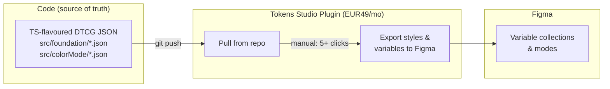
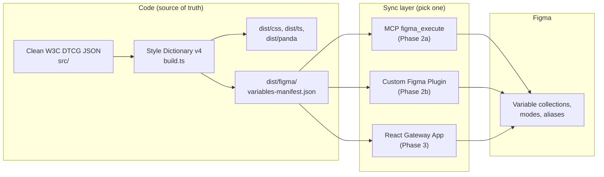

# Architectural Plan: Remove Tokens Studio, Automate DTCG JSON to Figma Variables

## Current State



**Pain points:** Manual multi-click workflow, EUR49/mo cost, proprietary Tokens Studio format lock-in (`$themes.json` with Figma IDs, bespoke `$type` values like `fontFamilies`/`boxShadow`, string-encoded numbers, percentage-encoded decimals).

---

## Proposed Architecture



The plan has two major phases executed in order:

1. **Phase 1 -- DTCG migration**: Clean up source token files to standard W3C DTCG (pre-2025.10 stable format), switch foundation colors to OKLCH, update the build pipeline to remove `@tokens-studio/sd-transforms`, delete Tokens Studio metadata
2. **Phase 2 -- Figma sync**: Build the Figma variables manifest format and sync tooling

---

## Phase 1: Migrate Source Tokens to W3C DTCG Standard

### Target format

The target is the **stable pre-2025.10 W3C DTCG community group report** -- the format that Style Dictionary v4, Terrazzo, and other tools currently implement. Key characteristics:

- Colors: OKLCH CSS function strings (`"oklch(0.704 0.1291 63.93)"`) as `$type: "color"` -- per-platform SD transforms convert to hex, RGBA, or pass through to CSS
- Dimensions: strings with units (`"16px"`, `"1.5rem"`) -- already correct for most tokens
- Font weight: JSON number (`400`), not string (`"400"`)
- Font family: string or array of strings -- already correct
- Duration: string with unit (`"200ms"`) under dedicated `duration` type
- Number: JSON number (`1.15`, `0.3`), not string
- Line height: `number` type with unitless multiplier (`1.15`), not percentage string (`"115%"`)
- Letter spacing: `dimension` type in `em` (`"-0.02em"`), not percentage string (`"-2%"`)
- Shadow: `shadow` type with `offsetX`/`offsetY` property names and dimension-valued sub-values

### File-by-file migration

#### 1. typography.json (5 groups to change)

**`fonts`** -- type rename only:

```json
// Before
"fonts": { "$type": "fontFamilies", ... }

// After
"fonts": { "$type": "fontFamily", ... }
```

**`fontSizes`** -- type rename only (values like `"16px"` are valid dimensions):

```json
// Before
"fontSizes": { "$type": "fontSizes", ... }

// After
"fontSizes": { "$type": "dimension", ... }
```

**`fontWeights`** -- type rename + values from string to number:

```json
// Before
"fontWeights": { "$type": "fontWeights",
  "regular": { "$value": "400" },
  "medium":  { "$value": "500" },
  "semibold": { "$value": "600" },
  "bold":    { "$value": "700" }
}

// After
"fontWeights": { "$type": "fontWeight",
  "regular": { "$value": 400 },
  "medium":  { "$value": 500 },
  "semibold": { "$value": 600 },
  "bold":    { "$value": 700 }
}
```

**`letterSpacings`** -- type change + values from percentage to em:

```json
// Before
"letterSpacings": { "$type": "letterSpacing",
  "dense": { "$value": "-2%" },
  "tight": { "$value": "-1%" },
  "normal": { "$value": "0%" },
  "relaxed": { "$value": "1%" },
  "wide": { "$value": "2%" },
  "loose": { "$value": "4%" },
  "spacious": { "$value": "10%" }
}

// After
"letterSpacings": { "$type": "dimension",
  "dense":    { "$value": "-0.02em" },
  "tight":    { "$value": "-0.01em" },
  "normal":   { "$value": "0em" },
  "relaxed":  { "$value": "0.01em" },
  "wide":     { "$value": "0.02em" },
  "loose":    { "$value": "0.04em" },
  "spacious": { "$value": "0.1em" }
}
```

Conversion: `N%` = `N/100 em` (both are relative to font size).

**`lineHeights`** -- type change + values from string to number:

```json
// Before
"lineHeights": { "$type": "lineHeights",
  "tight":   { "$value": "1.15" },
  "compact": { "$value": "1.2" },
  "normal":  { "$value": "1.3" },
  "relaxed": { "$value": "1.4" }
}

// After
"lineHeights": { "$type": "number",
  "tight":   { "$value": 1.15 },
  "compact": { "$value": 1.2 },
  "normal":  { "$value": 1.3 },
  "relaxed": { "$value": 1.4 }
}
```

#### 2. textStyles.json (replace inline values with token references)

Currently, text styles use hardcoded percentage strings for lineHeight and letterSpacing. These should reference the foundation tokens (which now hold clean DTCG values). The Figma transformer (Phase 2) will convert `em` to `%` and number to `%` as needed.

```json
// Before (every text style entry)
{
  "fontFamily": "{fonts.serif}",
  "fontSize": "{fontSizes.6xl}",
  "fontWeight": "{fontWeights.regular}",
  "lineHeight": "115%",
  "letterSpacing": "-2%"
}

// After (using references to foundation tokens)
{
  "fontFamily": "{fonts.serif}",
  "fontSize": "{fontSizes.6xl}",
  "fontWeight": "{fontWeights.regular}",
  "lineHeight": "{lineHeights.tight}",
  "letterSpacing": "{letterSpacings.dense}"
}
```

This is a large file (~1100 lines, ~120 text style entries) but the mapping is systematic:

- `"115%"` -> `"{lineHeights.tight}"` (1.15)
- `"120%"` -> `"{lineHeights.compact}"` (1.2)
- `"130%"` -> `"{lineHeights.normal}"` (1.3)
- `"140%"` -> `"{lineHeights.relaxed}"` (1.4)
- `"-2%"` -> `"{letterSpacings.dense}"`
- `"-1%"` -> `"{letterSpacings.tight}"`
- `"0%"` -> `"{letterSpacings.normal}"`
- `"1%"` -> `"{letterSpacings.relaxed}"`
- `"2%"` -> `"{letterSpacings.wide}"`
- `"4%"` -> `"{letterSpacings.loose}"`
- `"10%"` -> `"{letterSpacings.spacious}"`

#### 3. shadows.json (type + structure change)

```json
// Before (Tokens Studio boxShadow)
"shadows": { "$type": "boxShadow",
  "xs": {
    "$value": {
      "color": "{colors.black.alpha.a5}",
      "x": "0",
      "y": "1",
      "blur": "2",
      "spread": "0",
      "type": "dropShadow"
    }
  }
}

// After (W3C DTCG shadow)
"shadows": { "$type": "shadow",
  "xs": {
    "$value": {
      "color": "{colors.black.alpha.a5}",
      "offsetX": "0px",
      "offsetY": "1px",
      "blur": "2px",
      "spread": "0px"
    }
  }
}
```

Changes per shadow entry: rename `x`/`y` to `offsetX`/`offsetY`, add `px` unit to all dimension values, remove `"type": "dropShadow"` (not part of W3C; pre-2025.10 has no inset concept, all shadows are drop shadows by default).

Multi-shadow arrays (e.g. `sm`, `md`, `lg`, `xl`) follow the same transformation per object in the array.

#### 4. radii.json (type rename only)

```json
// Before
"radii": { "$type": "borderRadius", ... }

// After
"radii": { "$type": "dimension", ... }
```

Values like `"8px"`, `"9999px"` are already valid dimensions.

#### 5. durations.json (type rename only)

```json
// Before
"durations": { "$type": "dimension", ... }

// After
"durations": { "$type": "duration", ... }
```

Values like `"200ms"` are already valid duration strings.

#### 6. opacity.json (type + value change)

```json
// Before
"opacity": { "$type": "opacity",
  "disabled":    { "$value": "30%" },
  "placeholder": { "$value": "50%" },
  "overlay":     { "$value": "70%" }
}

// After
"opacity": { "$type": "number",
  "disabled":    { "$value": 0.3 },
  "placeholder": { "$value": 0.5 },
  "overlay":     { "$value": 0.7 }
}
```

#### 7. colors.json (switch from hex to OKLCH)

Foundation color palettes are already generated in OKLCH space (via `scripts/generate-palette.ts` using `chroma-js` and the palette-generator app using `culori`). Currently, the generators convert to hex at the output step. The change: **output `oklch()` CSS function strings instead of hex, and let per-platform SD transforms convert to the appropriate format.**

```json
// Before (hex)
"amber": {
  "50":  { "$value": "#FFFBF5" },
  "500": { "$value": "#D78D3F" },
  "950": { "$value": "#280D02" },
  "alpha": {
    "a10": { "$value": "#d78d3f1a" }
  }
}

// After (OKLCH CSS strings)
"amber": {
  "50":  { "$value": "oklch(0.992 0.0103 63.93)" },
  "500": { "$value": "oklch(0.704 0.1291 63.93)" },
  "950": { "$value": "oklch(0.17 0.0258 63.93)" },
  "alpha": {
    "a10": { "$value": "oklch(0.704 0.1291 63.93 / 0.1)" }
  }
}
```

**Why OKLCH as source format:**

- Perceptually uniform: lightness and chroma values are meaningful and comparable across hues
- The palette generator already thinks in OKLCH -- storing OKLCH preserves the authored intent without lossy hex round-tripping
- Modern CSS supports `oklch()` natively -- the CSS output can use it directly
- Each platform gets the optimal format via SD transforms (hex for RN, oklch for CSS/Panda, RGBA for Figma)
- Forward-compatible with the W3C DTCG 2025.10 draft structured color format

**What changes in the generators:**

- `scripts/generate-palette.ts`: Change `toDTCG()` to output `oklch(L C H)` strings instead of hex. Also add alpha ramp generation that outputs `oklch(L C H / alpha)`.
- The palette-generator app already stores OKLCH values per step; its export/copy functions would output `oklch()` strings.

**Per-platform SD color transforms:**

| Platform       | Transform              | Output                                                                             |
| -------------- | ---------------------- | ---------------------------------------------------------------------------------- |
| CSS            | passthrough            | `oklch(0.704 0.1291 63.93)` -- native CSS, all modern browsers                     |
| Panda JSON     | passthrough            | `"oklch(0.704 0.1291 63.93)"` -- Panda outputs CSS custom properties, oklch native |
| TypeScript     | `reva/color/hex`       | `"#D78D3F"` -- hex for programmatic use (canvas, charting libs)                    |
| React Native   | `reva/color/hex`       | `"#D78D3F"` -- RN doesn't support oklch, needs hex or rgba                         |
| Figma manifest | `reva/color/figmaRgba` | `{ r: 0.843, g: 0.553, b: 0.247, a: 1 }` -- Figma Plugin API needs sRGB 0-1        |

The `chroma-js` library (already a `devDependency`) or `culori` can handle `oklch()` string parsing and conversion to any target color space.

**Semantic color tokens (light.json, dark.json) stay as references** -- they point to foundation colors via `{colors.amber.50}` etc. When SD resolves these references, it gets the OKLCH value from the foundation, and the platform transform converts it.

#### 8. light.json / dark.json (remove non-standard boolean)

The `misc.lightMode` / `misc.darkMode` boolean tokens use `$type: "boolean"`, which has no W3C DTCG equivalent. Options:

- **Remove them entirely** if nothing consumes them (most likely; these seem to be Tokens Studio control tokens)
- Move to `$extensions` if they serve a purpose in the build

#### 9. Delete Tokens Studio metadata

- Delete `src/$themes.json` (~1188 lines of Figma IDs and theme mappings)
- Delete `src/$metadata.json` (token set order; `build.ts` already uses filesystem discovery)

### Build pipeline changes

**Replace `@tokens-studio/sd-transforms`** with SD4's native DTCG support in `config/build.ts`:

- Remove `register(StyleDictionary, ...)` call from `@tokens-studio/sd-transforms`
- Use SD4's built-in DTCG preprocessor (`preprocessors: ['dtcg']` -- SD4 ships this)
- Replace the `tokens-studio` transform group with SD4 built-in transforms + custom ones:
  - Keep the existing custom `reva/size/pxToRem` transform (CSS-only px-to-rem conversion)
  - Add `reva/color/oklchToHex` -- converts `oklch()` strings to hex for TS and React Native platforms; uses `chroma-js` (already a dependency)
  - CSS and Panda platforms: pass `oklch()` through as-is (Panda generates CSS custom properties, modern browsers support oklch natively)
  - Add `reva/shadow/css` -- formats W3C shadow composites into CSS `box-shadow` shorthand
  - Add `reva/fontWeight/number` if needed (SD4 may handle number passthrough natively)
- Remove `@tokens-studio/sd-transforms` from `devDependencies` in `package.json`
- Update the Panda format builders in `config/panda-format.ts` if the intermediate JSON structure changes

**Verification**: After all changes, run `bun run tokens:build` and diff every output file (CSS, TS, Panda JSON, DTCG JSON) against the previous build to confirm that resolved values produce visually identical results. Color values will differ in representation (hex vs oklch) but must be colorimetrically equivalent.

---

## Phase 2: Figma Variables Manifest + Sync

### The Figma Variables Manifest

A new SD platform (`figma`) in `config/build.ts` outputs `dist/figma/variables-manifest.json`. This is the contract between the token pipeline and any sync mechanism.

**Structure:**

```json
{
  "version": "1.0",
  "collections": [
    {
      "name": "Foundation",
      "modes": ["value"],
      "variables": [
        {
          "name": "colors/amber/50",
          "type": "COLOR",
          "description": "...",
          "values": {
            "value": { "r": 1.0, "g": 0.984, "b": 0.961, "a": 1.0 }
          }
        },
        {
          "name": "spacing/1",
          "type": "FLOAT",
          "description": "Base spacing unit (4px)",
          "values": { "value": 4 }
        }
      ]
    },
    {
      "name": "Color mode",
      "modes": ["light", "dark"],
      "variables": [
        {
          "name": "colors/bg/canvas",
          "type": "COLOR",
          "description": "Page/screen background",
          "values": {
            "light": { "alias": "Foundation/colors/olive/50" },
            "dark": { "alias": "Foundation/colors/stone/850" }
          }
        }
      ]
    },
    {
      "name": "Typography",
      "modes": ["value"],
      "variables": [
        {
          "name": "fonts/text",
          "type": "STRING",
          "description": "Primary sans-serif for body text",
          "values": { "value": "Inter Tight" }
        },
        {
          "name": "fontSizes/md",
          "type": "FLOAT",
          "description": "...",
          "values": { "value": 16 }
        }
      ]
    }
  ]
}
```

**Key design decisions:**

- **Variable names** use `/` separators (Figma convention for grouping), derived from the token path
- **`alias` references** preserve the semantic-to-foundation relationship so Figma creates proper variable aliases (not just resolved values)
- **DTCG type to Figma type mapping:** `color` -> `COLOR`; `dimension`/`duration`/`number`/`fontWeight` -> `FLOAT` (extracted numeric value); `fontFamily` -> `STRING`
- **Value conversions in the Figma format layer** (not in source tokens):
  - `color` `oklch(0.704 0.1291 63.93)` -> sRGB -> `{ r, g, b, a }` normalized 0-1
  - `dimension` `"16px"` -> extract numeric `16`; `"1.5rem"` -> multiply by 16 = `24`
  - `duration` `"200ms"` -> numeric `200`
  - `number` lineHeight `1.15` -> Figma percentage string: `"115%"` (for text style variable binding)
  - `dimension` letterSpacing `"-0.02em"` -> Figma percentage string: `"-2%"` (for text style variable binding)
- **Complex types excluded:** `shadow` and composite `typography` tokens cannot be Figma variables -- they become Figma effect/text styles via a separate mechanism (not in scope here)
- **Collection/mode mapping** defined in `config/figma-collections.ts`:

```typescript
export const figmaCollections = [
  {
    name: 'Foundation',
    modes: [{ name: 'value', sources: ['foundation'] }],
  },
  {
    name: 'Color mode',
    modes: [
      { name: 'light', sources: ['colorMode/light'] },
      { name: 'dark', sources: ['colorMode/dark'] },
    ],
    includeRefs: ['foundation'],
  },
  {
    name: 'Typography',
    modes: [{ name: 'value', sources: ['foundation/typography'] }],
  },
]
```

### Phase 2a: MCP-Driven Sync

**Goal:** Zero-click sync from Cursor. You say "sync tokens to Figma" and the assistant handles the rest.

**How it works:**

1. `bun run tokens:build` produces `dist/figma/variables-manifest.json`
2. A helper script, `scripts/figma-sync-code.ts`, reads the manifest and generates self-contained Plugin API JavaScript code that creates/updates all variables
3. The assistant calls `figma_execute` (via MCP) with this generated code

**Why `figma_execute` over `figma_setup_design_tokens`:** The MCP tool `figma_setup_design_tokens` has a 100-token limit and doesn't support variable aliases. `figma_execute` runs arbitrary Plugin API code, which can:

- Create unlimited variables in a single execution (within the 30s timeout)
- Set up cross-collection variable aliases via `figma.variables.createVariableAlias()`
- Diff against existing variables (update existing, create new, optionally delete stale)
- Handle the full variable lifecycle

**Timeout concern:** With ~500+ variables, the 30s timeout should be sufficient since Plugin API calls are fast (they're local DOM operations). If needed, the script can split into batches (one per collection) and the assistant makes multiple `figma_execute` calls.

### Phase 2b: Custom Figma Development Plugin (Near-Term)

**Goal:** Standalone one-click sync that doesn't require Cursor or AI mediation.

A lightweight Figma development plugin (no Figma review/publishing needed -- it's a local dev plugin):

- **UI:** Single screen with a URL input (defaults to `http://localhost:PORT/variables-manifest.json` or a GitHub raw URL) and a "Sync" button
- **Logic:** Fetches the manifest JSON, diffs against existing local variables (by name), creates/updates/deletes as needed, reports a summary
- **Lives in:** `tools/figma-variable-sync/` (separate from the main packages, similar to the existing `tools/palette-generator/`)

**Plugin capabilities (all available on Professional plan):**

- `figma.variables.createVariableCollection(name)`
- `figma.variables.createVariable(name, collectionId, resolvedType)`
- `variable.setValueForMode(modeId, value)`
- `figma.variables.createVariableAlias(variable)` for cross-collection references
- `figma.variables.getLocalVariableCollections()` and `getLocalVariables()` for diffing

**Serving the manifest for the plugin to fetch:**

- **Local dev:** `bun run tokens:serve` starts a static file server on `dist/figma/`
- **CI/CD:** Commit `dist/figma/variables-manifest.json` or publish to a known URL

### Phase 3: React Gateway App (Future)

Not in scope for implementation now, but the architecture supports it:

- A React app (could live in `apps/token-gateway/`) that reads and displays all tokens
- Inline editing with live preview
- "Push to Code" button: commits changes to the JSON source files via GitHub API
- "Push to Figma" button: sends the manifest to a local Figma plugin (via `postMessage`) or uses the same Plugin API code generation from Phase 2a
- Single source of truth for viewing and managing the full token lifecycle

The variables manifest format is the shared contract that makes all phases interoperable.

---

## Risk Assessment

| Risk                                                                     | Mitigation                                                                                                    |
| ------------------------------------------------------------------------ | ------------------------------------------------------------------------------------------------------------- |
| DTCG migration breaks downstream outputs (CSS, Panda)                    | Diff all build outputs before/after migration; fix any regressions before moving on                           |
| OKLCH source colors produce slightly different hex after round-trip      | Use `chroma-js` gamut clamping; compare against current hex values and accept sub-1 delta-E differences       |
| OKLCH `oklch()` strings not recognised by some SD built-in transforms    | Register custom `reva/color/oklchToHex` transform early, before any built-in transforms that expect hex input |
| Shadow CSS shorthand needs custom transform after removing sd-transforms | Write a small `reva/shadow/css` custom SD transform (~20 lines)                                               |
| `figma_execute` 30s timeout too short for 500+ vars                      | Split into per-collection batches; each collection is a separate `figma_execute` call                         |
| Variable aliases fail cross-collection                                   | Ensure foundation collection is created first; test with a small set before full sync                         |
| Figma Professional plan mode limit (4 per collection)                    | Current design uses max 2 modes (light/dark); plenty of headroom                                              |
| Future brand themes need more modes                                      | Each brand can be a separate collection, or use the 4-mode budget                                             |

---

## Recommended Implementation Order

**Phase 1 -- DTCG Migration (do first):**

1. Migrate `typography.json` -- type renames + value format changes (font weights to numbers, letter spacings to em, line heights to numbers)
2. Migrate `shadows.json` -- type rename + structural changes (offsetX/Y, units, remove type field)
3. Migrate `radii.json`, `durations.json`, `opacity.json` -- type renames + opacity value changes
4. Migrate `textStyles.json` -- replace inline percentages with `{lineHeights.*}` and `{letterSpacings.*}` references
5. Handle boolean tokens in `light.json`/`dark.json`
6. Update `scripts/generate-palette.ts` to output `oklch()` CSS strings; regenerate all palettes in `colors.json` (solid steps + alpha ramps)
7. Update `config/build.ts` -- replace `@tokens-studio/sd-transforms` with SD4 native DTCG preprocessor + custom transforms (`reva/color/oklchToHex` for TS/RN only, `reva/shadow/css`, keep `reva/size/pxToRem`; CSS and Panda pass oklch through)
8. Verify all build outputs produce correct values
9. Delete `$themes.json` and `$metadata.json`

**Phase 2 -- Figma Sync (after Phase 1 is stable):**

1. Create `config/figma-collections.ts` -- collection/mode mapping
2. Create `config/figma-format.ts` -- SD format that produces the manifest (with oklch->RGBA, em->%, number->% conversions for Figma)
3. Integrate `figma` platform into `build.ts`
4. Create `scripts/figma-sync-code.ts` -- Plugin API code generator
5. Test via MCP `figma_execute` against a Figma file
6. Build custom Figma development plugin in `tools/figma-variable-sync/`
